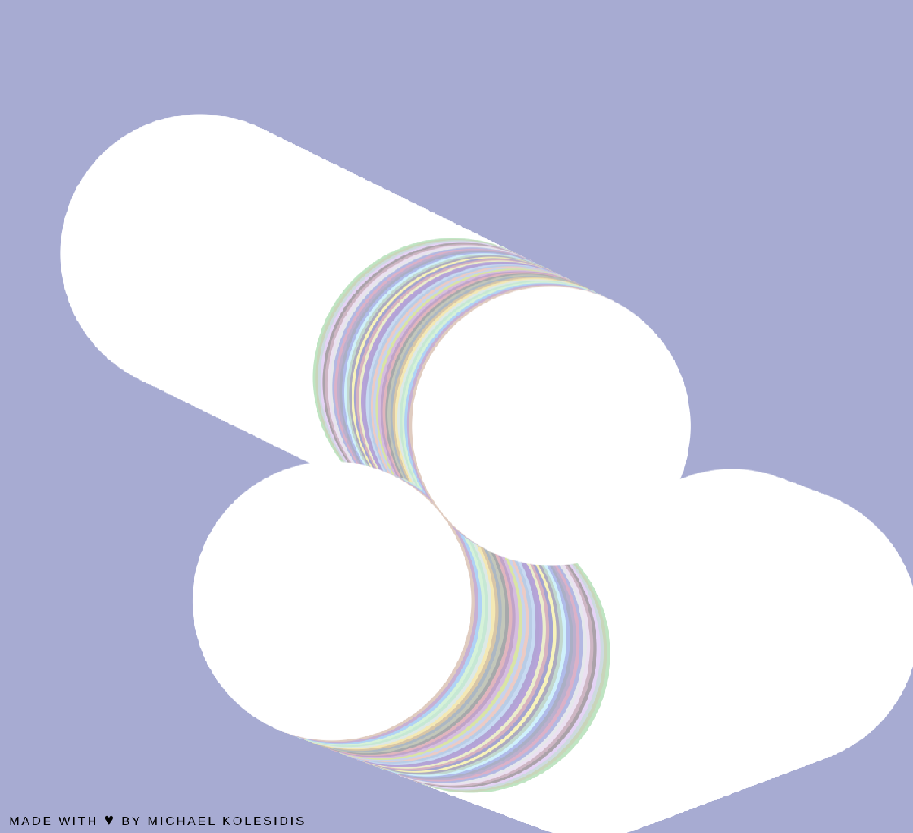
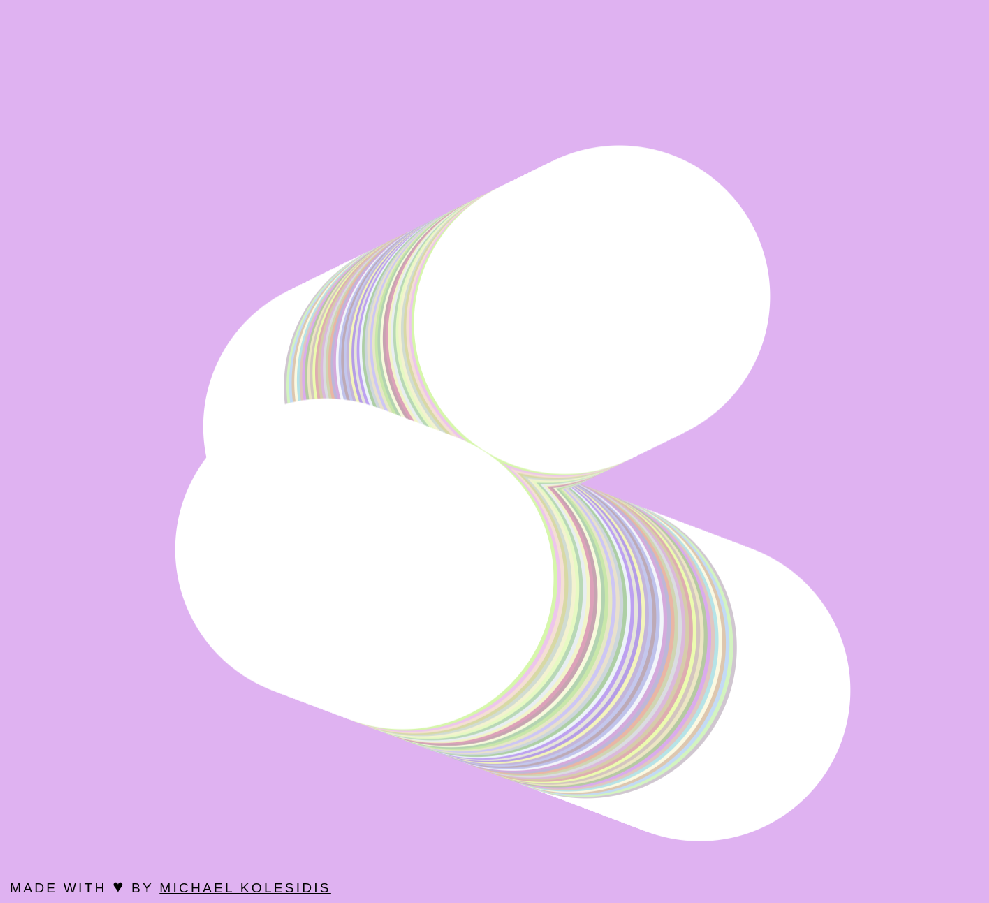
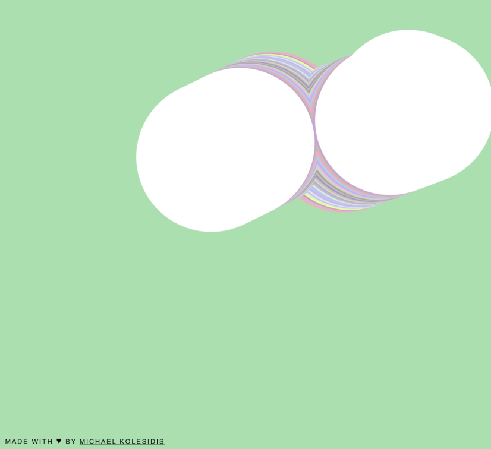
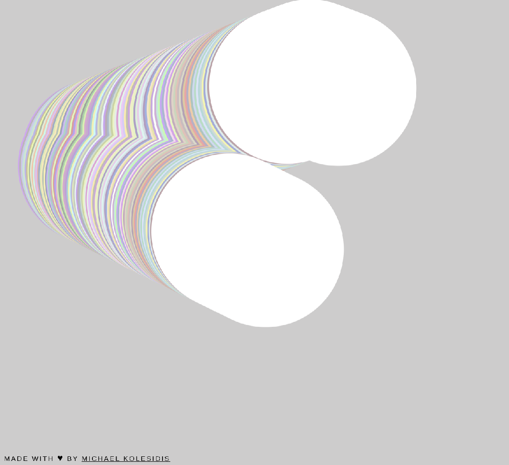
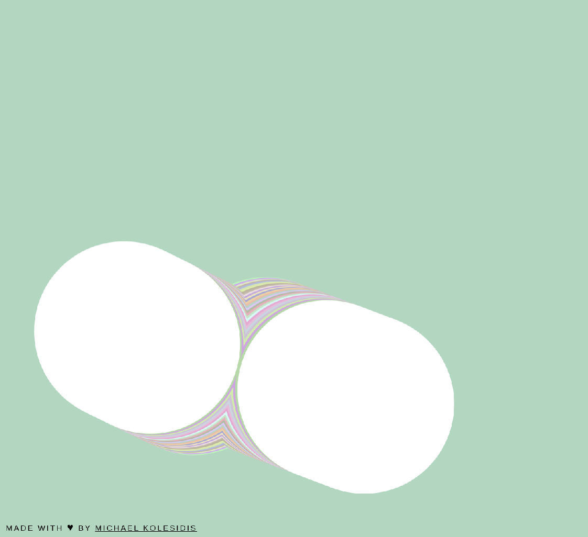

  
  <h1>intersecting circles</h1>
  
  <h4>colorful explosions occur when two circles are interescting.</h4>

  
## Technologies Used

&nbsp;&nbsp;&nbsp;&nbsp;&nbsp;&nbsp;

&nbsp;&nbsp;&nbsp;&nbsp;&nbsp;&nbsp;

&nbsp;&nbsp;&nbsp;&nbsp;&nbsp;&nbsp;

&nbsp;&nbsp;&nbsp;&nbsp;&nbsp;&nbsp;

## Description

Two circles move with random speeds and change colors when intersecting. THe backround is refreshed every few seconds.

Double-click anywhere to enter fullscreen mode, double-click again (or press ESC) to leave fullscreen mode.

## Screenshots

## License

<<<<<<< HEAD

=======

Copyright (c) 2022 Michael Kolesidis 
Licensed under the [GNU General Public License v3.0](https://www.gnu.org/licenses/gpl-3.0.html).
>>>>>>> 945803f7dc7fa91facd2a4c4eaec4c44a2191686

Copyright (c) 2023 Michael Kolesidis 
Licensed under the [GNU Affero General Public License v3.0](https://www.gnu.org/licenses/agpl-3.0.html).
